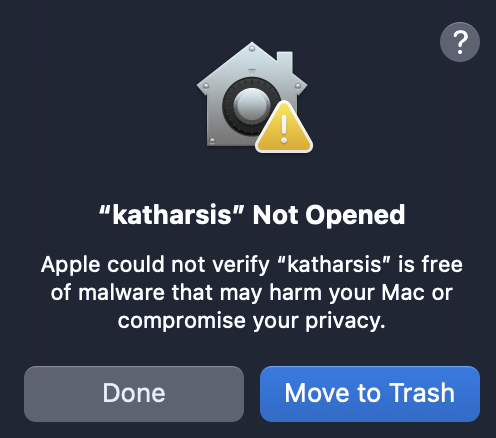
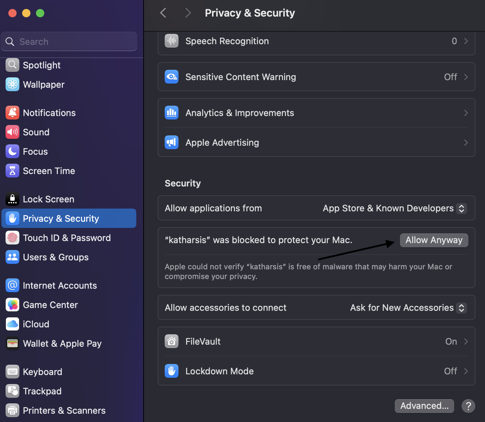

# FAQ

## Encountering System Security Policy on First Run of Katharsis on macOS

When you first run Katharsis on macOS, you might see a system security warning that looks like this:

This happens because the Katharsis binary was not signed with an Apple Developer Certificate during its build process in the [Actions](https://github.com/kurosakishigure/katharsis/actions/workflows/cd.yml). To resolve this issue, you can use the following steps:

In the future, we plan to address this problem by enabling installation of Katharsis through package managers like [brew](https://brew.sh). If you're interested in helping us implement this feature, you can contribute by following the guidelines in [CONTRIBUTING.md](CONTRIBUTING.md).
